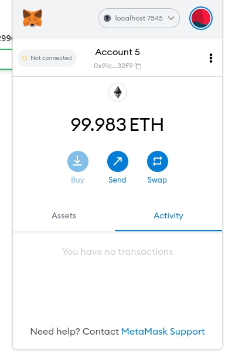

# TODO-APP-USING-BLOCKCHAIN

## Prerequisites

- Node.js
- Ganache
- Truffle
- Metamask browser extension

[Download Node.js](https://nodejs.org/en/download/)  
[Download Ganache](https://trufflesuite.com/ganache/index.html)   
install truffle using npm  
`npm install -g truffle`  
[Metamask for Firefox](https://addons.mozilla.org/en-US/firefox/addon/ether-metamask/)  
[Metamask for Chrome](https://chrome.google.com/webstore/detail/metamask/nkbihfbeogaeaoehlefnkodbefgpgknn?hl=en)
## Setup

Navigate to todo-app-using-blockchain/ directory  
`cd todo-app-using-blockchain` 

### setup dev tools

Install the node dependencies  
`npm install`

Open Ganache to run local blockchain node

Click on Quick Start,Now you will be prompted with 10 accounts with 100 ethers each for developing and testing.

Click on key icon of first account to see private key of first account and copy the private key

Now, open browser click on metamask extension.
You will find a dropdown of networks, click on it and add a network and fill the following details and save.

Switch the network to __localhost 7545__

Click on accounts avatar and select import account

Paste the private key in and click import

The imported account has same address and balance of first account in ganache

### compiling and deploying smart contracts

Navigate to todo-app-using-blockchain/ directory  
`cd todo-app-using-blockchain` 

Run the following command to compile the smart contracts  
`truffle compile`

Run the following command to deploy the compiled smart contracts to ganache
`truffle migrate --reset`

### Run next development server

In todo-app-using-blockchain/ directory run the following command  
`npm run dev`

Open browser and go to http://localhost:3000 to view the user interface

### Connect the imported account to wallet 

- Click on account avatar and select the imported account
  

- Click on __not connected__ next to account name, you will be prompted to connect the account

- Click __connect__

- The account will be connected (the account balance is reduced because, some amount is spent while deploying smart contracts on ganache)

Now, the connected account is displayed on top right corner of webpage

## Using app

Initially there will be no tasks
#### Create tasks
Create tasks using input field and and add button

After clicking add button metamask pops up to confirm 

Click confirm, the task will be added to list

Similary, I've added three more tasks

#### Toggle mark as completed
Toggle mark as completed by clicking checkbox

#### Update the task

Update the task by clicking on update button

#### Delete the task

## Play around with accounts

- Import another account by copy pasting the private key from ganache and add to metamask

- The tasks will be seperate for each individual account

- Switch the metamask account to newly imported account and refresh the web page, you will see the empty task list because it is new account (notice the account address). 

- Add some more tasks

- Switch back to previous account and refresh the page

- It will be similar with any other accounts